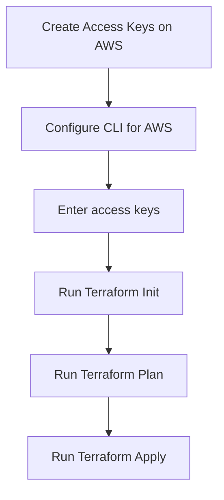

# Manage EC2 Instance via Terraform
## Overview

## Process

This script creates an AWS instance using the 'aws_instance' resource with a specific 'AMI ID' and instance type. 

A 'null_resource' is created so that it will act as a timer to automatically destroy the instance after 90 seconds. The 'triggers' block specifies that the resource depends on the instance ID from the 'aws_instance' resource. 

A 'local-exec' provisioner is used to run a command that waits for 90 seconds before destroying the instance. The Terraform destroy command in the '-target' flag specifies that the 'aws_instance.sample' resource is to be destroyed. The '-auto-approve' flag gives automatic approval for the destruction of the instance without further confirmation. 

## AWS Credentials

First establish an AWS account. Create a user under IAM and create access keys for that user. If you already have keys you can utilize those. In the terminal configure aws with the aws configure command and enter the keys as prompted. 

Note that the usual and recommended way to authenticate to AWS when using Terraform is via the AWS CLI. To do this, first, install the AWS CLI, then type 'aws configure'. You can then enter your access key ID, secret access key, and default region.

## Running the Script
Once the credentials are created then you can run the script. Run in the CLI 'terraform init' to initialize terraform. Then run 'terraform plan' to review the script plan and catch any errors. Finally run 'terraform apply' to apply the script.

## Considerations
This script does not address edge cases. There is at the moment a conflict while accessing AWS credentials. This needs to be fixed.