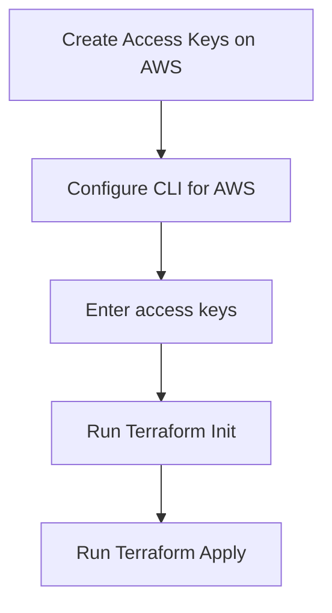

# Manage EC2 Instance via Terraform

```mermaid
graph TD;
A[Create Access Keys on AWS]; 
A --> B[Configure CLI for AWS];
B --> C[Enter access keys];
C --> D[Run Terraform Init];
D --> E[Run Terraform Apply]
```